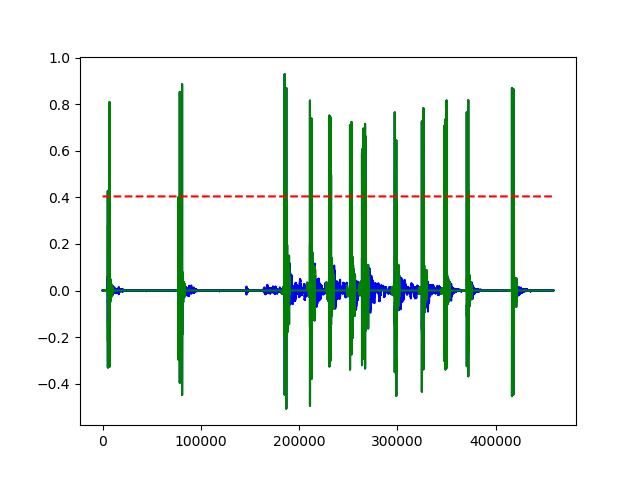

# GunsHot
### Using Hotword Detection Techniques to identify gunfire

## TODO: 
* Add GCloud Training
UrbanSounds 

The dataset contains a vast collection of urban background noise but only around *100* Gunshots

In order to expand our dataset

just below half the max value in any given clip is set a a threshold ..
This mask is then dilated several times

The Extracted Chunks are then stored in the ```GunClips```
## Setup
RawSounds/ 
GunClips/
FusedSounds/
DataLabels/